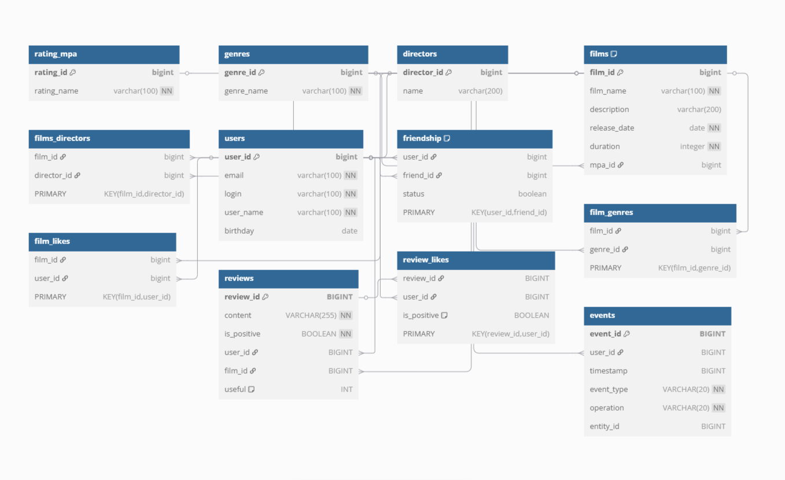

# java-filmorate
## Схема БД


<details>
  <summary>Код схемы БД</summary>

```
Table rating_mpa {
  rating_id bigint [primary key, increment] 
  rating_name varchar(100) [not null]    
}

Table genres {
  genre_id bigint [primary key, increment] 
  genre_name varchar(100) [not null] 
}

Table directors {
  director_id bigint [primary key, increment]
  name varchar(200) [unique] 
}

Table films {
  film_id bigint [primary key, increment]  
  film_name varchar(100) [not null] 
  description varchar(200)
  release_date date [not null]  
  duration integer [not null] 
  mpa_id bigint 
  Indexes {
    mpa_id [name: 'idx_films_mpa_id'] 
  }
}


Table films_directors {
  film_id bigint 
  director_id bigint 
  PRIMARY KEY (film_id, director_id) 
}

Table users {
  user_id bigint [primary key, increment] 
  email varchar(100) [not null, unique]  
  login varchar(100) [not null, unique] 
  user_name varchar(100) [not null] 
  birthday date
}

Table friendship {
  user_id bigint 
  friend_id bigint 
  status boolean 
  PRIMARY KEY (user_id, friend_id) 
  Indexes {
    user_id [name: 'idx_friendship_user_id'] 
  }
}


Table film_genres {
  film_id bigint 
  genre_id bigint 
  PRIMARY KEY (film_id, genre_id) 
}


Table film_likes {
  film_id bigint 
  user_id bigint 
  PRIMARY KEY (film_id, user_id) 
}

Table reviews {
 review_id BIGINT [primary key, increment] 
 content VARCHAR(255) [not null] 
 is_positive BOOLEAN [not null] 
 user_id BIGINT 
 film_id BIGINT 
 useful INT  [default: 0] 
}

Table review_likes {
 review_id BIGINT 
 user_id BIGINT 
 is_positive BOOLEAN [default: true] 
 PRIMARY KEY (review_id, user_id) 
}


Table events {
    event_id BIGINT [primary key, increment]
    user_id BIGINT
    timestamp BIGINT 
    event_type VARCHAR(20) [not null]
    operation VARCHAR(20) [not null] 
    entity_id BIGINT
}


// Определение связей между таблицами
Ref: films.mpa_id > rating_mpa.rating_id
Ref: films_directors.film_id > films.film_id
Ref: films_directors.director_id > directors.director_id
Ref: friendship.user_id > users.user_id
Ref: friendship.friend_id > users.user_id
Ref: film_genres.film_id > films.film_id
Ref: film_genres.genre_id > genres.genre_id
Ref: film_likes.film_id > films.film_id
Ref: film_likes.user_id > users.user_id
Ref: reviews.user_id > users.user_id
Ref: reviews.film_id > films.film_id
Ref: review_likes.review_id > reviews.review_id
Ref: review_likes.user_id > users.user_id
Ref: events.user_id > users.user_id
```
</details>

<details>
  <summary>Описание схемы БД</summary>

### Эта схема представляет собой базу данных для платформы, посвященной фильмам. Вот описание таблиц и их предназначения:
+ rating_mpa: Хранит информацию о возрастных рейтингах фильмов (например, PG-13, R).
+ genres: Содержит список жанров фильмов (например, комедия, драма, боевик).
+ directors: Хранит имена режиссеров фильмов.
+ films: Основная таблица, содержащая информацию о каждом фильме: название, описание, дату выхода, продолжительность и возрастной рейтинг.
+ films_directors: Связывает фильмы с режиссерами (многие ко многим).
+ users: Хранит информацию о зарегистрированных пользователях платформы.
+ friendship: Описывает отношения дружбы между пользователями.
+ film_genres: Связывает фильмы с их жанрами (многие ко многим).
+ film_likes: Регистрирует лайки, поставленные пользователями фильмам.
+ reviews: Содержит отзывы пользователей о фильмах.
+ review_likes: Позволяет пользователям ставить лайки или дизлайки отзывам.
+ events: Отслеживает действия пользователей на платформе (например, добавление фильма в друзья, добавление отзыва, лайк отзыва). Это полезно для аналитики и отладки.

### Эта структура позволяет хранить данные о фильмах, пользователях и их взаимодействии, что необходимо для работы любой платформы, связанной с кино
### Цель базы данных - предоставить платформу для поиска фильмов, обмена мнениями о фильмах, формирования социальных связей между пользователями на основе их предпочтений в кино.
</details>
