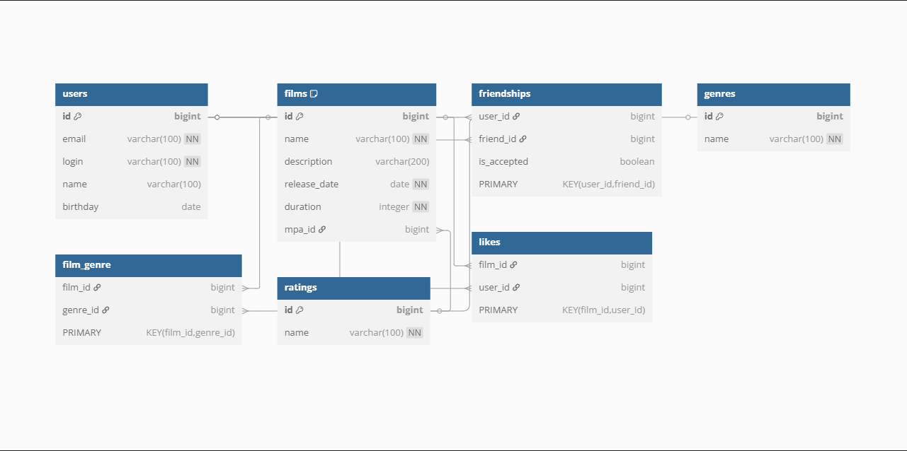

# java-filmorate
## Схема БД


<details>
  <summary>Код схемы БД</summary>

```
Table users {
  id bigint [primary key, increment]
  email varchar(100) [not null]
  login varchar(100) [not null]
  name varchar(100)
  birthday date
}

Table films {
  id bigint [primary key, increment]
  name varchar(100) [not null]
  description varchar(200)
  release_date date [not null]
  duration integer [not null]
  mpa_id bigint
  Indexes {
    mpa_id [name: 'idx_films_mpa_id']
  }
}

Table friendships {
  user_id bigint
  friend_id bigint
  is_accepted boolean
  PRIMARY KEY (user_id, friend_id)
}

Table genres {
  id bigint [primary key, increment]
  name varchar(100) [not null]
}

Table film_genre {
  film_id bigint
  genre_id bigint
  PRIMARY KEY (film_id, genre_id)
}

Table ratings {
  id bigint [primary key, increment]
  name varchar(100) [not null]
}

Table likes {
  film_id bigint
  user_id bigint
  PRIMARY KEY (film_id, user_id)
}

Ref: films.mpa_id > ratings.id
Ref: film_genre.film_id > films.id
Ref: film_genre.genre_id > genres.id
Ref: likes.film_id > films.id
Ref: likes.user_id > users.id
Ref: friendships.user_id > users.id
Ref: friendships.friend_id > users.id

```
</details>

<details>
  <summary>Описание схемы БД</summary>

### Эта схема представляет собой базу данных для хранения информации о :
+ пользователях
+ фильмах
+ жанрах
+ рейтингах
+ лайках
+ дружеских связях.

### В таблицах:
+ friendships
+ film_genre
+ likes

Используются ***составные первичные ключи*** для обеспечения уникальности связей между записями.

</details>
